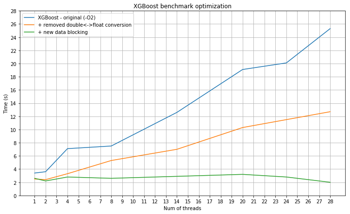

The `hist` method of XGBoost scales poorly on multi-core CPUs: a demo script
============================================================================
# Overview

Currently, the `hist` tree-growing algorithm (`tree_method=hist`) of [XGBoost](https://github.com/dmlc/xgboost)
scales poorly on multi-core CPUs: for some datasets, performance deteriorates as the number of threads is increased.
This issue was discovered by [@Laurae2](https://github.com/Laurae2)'s
[Gradient Boosting Benchmark](https://sites.google.com/view/lauraepp/new-benchmarks).

To make things easier for contributors, XGBoost went ahead and isolated the performance bottleneck. A vast majority of time (> 95 %)
is spent in a stage known as **gradient histogram construction**. This repository isolates this stage so that it is easy to
fix and improve.

We applied practice used in [Intel® Data Analytics Acceleration Library \(Intel® DAAL\)](https://github.com/intel/daal) for Gradient Boosting optimizations to this benchmarks, result are below.

# Optimizations for Intel° Architecture

### Removing of floating point numbers conversion: 

We have found that XGBoost uses “float” for gradients pairs, but “double” for histograms. When XGBoost computes histograms it always converts floats to doubles in runtime, this operation is expensive. If replace  “doubles” data type to “floats” in histograms performance are following:
 
|# of cores               |1   |2  |4  |8  |14  |20  |24  |28  |
|:------------------------|----|---|---|---|----|----|----|----|
|original (-O2 option), s |3.4 |3.6|7.1|7.5|12.6|19.1|20.1|25.3|
|w/o convertaion, s       |2.5 |2.4|3.3|5.3|7.0 |10.3|11.5|12.7|

### Threading:
At the current implementation we see that XGBoost builds a histogram by blocks of size 8. In the data set "rowind-198-?.txt" -  indexes of samples for some node in a tree. We can see that many of them contains only 10-500 samples. It is too small number to try to parallelize it, in this case overhead for creation of the tasks by OMP can be larger than useful work for histogram computation. We tried to limit block size by 512 rows and now we don’t see performance degradation with increase of thread number:

|# of cores               |1   |2  |4  |8  |14  |20  |24  |28  |
|:------------------------|----|---|---|---|----|----|----|----|
|original (-O2 option), s |3.4 |3.6|7.1|7.5|12.6|19.1|20.1|25.3|
|w/o convertaion, s       |2.5 |2.4|3.3|5.3|7.0 |10.3|11.5|12.7|
|512-rows blocking, s     |2.6 |2.2|2.8|2.6|2.9 |3.2 |2.8 |2.0 |



However, in this case we just utilize only one core of CPU for low levels of the tree and don’t archive optimal performance on multi-core CPU. How do we solve this issue in [Intel® DAAL](https://github.com/intel/daal)? - we have 2 levels of parallelism: inside each node (represented in XGBoost) and by nodes (not represented in XGBoost). On the first levels of the tree the main threading are inside nodes, for last levels - threading by nodes. Adding of parallelism by nodes in XGBoost – required for good thread scalability.
We had done experiments with this block size in DAAL and 512 rows – was optimal number for data sets which we used.

### Implicit usage of C-arrays + no unroll:

For build of histograms you use STL-containers and do unroll by 8 rows. However, usage of STL can bring some overhead, build of histograms is hotspot, so let’s use data() method for access to internal data of std::vector.
Also, unroll like this in no efficient, due to copy of data from arrays to buffers – additional overhead and working with memory. 
```Cpp
size_t kUnroll = 8;
size_t rid[kUnroll];
size_t ibegin[kUnroll];
size_t iend[kUnroll];
GradientPair stat[kUnroll];
for (int k = 0; k < kUnroll; ++k) {
  rid[k] = instance_set[i + k];
}
for (int k = 0; k < kUnroll; ++k) {
  ibegin[k] = gmat.row_ptr[rid[k]];
  iend[k] = gmat.row_ptr[rid[k] + 1];
}
for (int k = 0; k < kUnroll; ++k) {
  stat[k] = gpair[rid[k]];
}
for (int k = 0; k < kUnroll; ++k) {
  for (size_t j = ibegin[k]; j < iend[k]; ++j) {
    const uint32_t bin = gmat.index[j];
    builder->data_[off + bin].Add(stat[k]);
  }
}
```
If remove this unroll and use C-style arrays we can get significant performance improvement and make code simpler :)
Modified code (build_hist.cc:171):
```Cpp
for(size_t i = iStart; i < iEnd; ++i)
{
    const size_t iColStart = row_ptr[rid[i]];
    const size_t iColEnd = row_ptr[rid[i]+1];
    const auto gh = gpair[rid[i]];

    for (size_t j = iColStart; j < iColEnd; ++j)
        data_local_hist[index[j]].Add(gh); // will be inlined by compiler with –O2 option
}
```

Let’s get indexes for 1 node: rowind-198-1 (contains 20.6k samples from 1m source samples – sparse variant) and measure performance for it.

|# of cores                                  |1   |2  |4  |8  |14  |20  |24  |28 |
|:-------------------------------------------|----|---|---|---|----|----|----|---|
|original (with unroll + STL, -O2 option), ms|11.5|6.5|3.9|3.2|3.5 |5.3 |6.0 |6.6|
|w/o unroll and STL, ms	                     |10.8|4.7|3.2|2.0|1.6 |1.7 |1.8 |2.0|

### Enabling of modern instruction sets (AVX-512):
At AVX-512 "scatter" (does stores to memory with some stride) instruction has been introduced. It can be useful for histogram computation together with "gather" (does loads of memory with some stride) instruction (available from AVX2). Unfortunately, compiler can't put this instructions in our case and we need to do by intrinsics. Usage of "gather-add-scatter" template written by intrinsics provides some performance improvement over baseline code built by compiler. Code with usage of AVX-512 (can be built by Intel compiler at the moment, build it for gcc is possible, but need to spend some time for it) in the fork.

|# of cores                                  |1   |2  |4  |8  |14  |20  |24  |28 |
|:-------------------------------------------|----|---|---|---|----|----|----|---|
|original (with unroll + STL, -O2 option), ms|11.5|6.5|3.9|3.2|3.5 |5.3 |6.0 |6.6|
|w/o unroll and STL, ms	                     |10.8|4.7|3.2|2.0|1.6 |1.7 |1.8 |2.0|
|w/o unroll and STL + AVX512, ms	           |10.2|4.7|3.2|2.0|1.5 |1.6 |1.7 |1.8|


# How to compile and run
1. Compile the script by running CMake:
```bash
mkdir build
cd build
cmake ..
make
```

2. Download [record.tar.bz2](https://s3-us-west-2.amazonaws.com/xgboost-examples/xgboost-fast-hist-perf-lab-record.tar.bz2) in the same directory.
3. Extract record.tar.bz2 by running `tar xvf record.tar.bz2`.
4. Run the script:
```bash
# Usage: ./perflab record/ [number of threads]
./perflab record/ 36
```

# What this script does
The script reads from record.tar.bz2, which was processed from the [Bosch dataset](https://www.kaggle.com/c/bosch-production-line-performance/data).
Its job is to compute histograms for gradient pairs, where each bin of histogram is a partial sum.

Some background:
* A **gradient** for a given instance `(X_i, y_i)` is a pair of `double` values that quantify the distance between the true label `y_i` and predicted label `yhat_i`.
* There are as many gradient pairs as there are instances in a training dataset.
* In order to find optimal splits for decision trees, we compute a **histogram** of gradients. Each bin of the histogram stands for a range of feature values. The value of the bin is given by the sum of gradients corresponding to the data points lying inside the range.
* In each boosting iteration, we have to compute multiple histograms, each histogram corresponding to a set of instances.

# Setting build types

* By default, 'Release' build type will be used, with flags `-O3 -DNDEBUG`.

* For perfiling, you may want to add debug symbols by choosing 'RelWithDebInfo' build type instead:
  ```bash
  cmake -DCMAKE_BUILD_TYPE=RelWithDebInfo ..
  ```
  This build type uses the following flags: `-O2 -g -DNDEBUG`.

* For full control over the compilation flags, specify `CMAKE_CXX_FLAGS_RELEASE`:
  ```bash
  cmake -DCMAKE_CXX_FLAGS_RELEASE="-O3 -g -DNDEBUG -march=native" ..
  ```
  This give you full control over the optimization flags. Here, we are compiling with `-O3 -g -DNDEBUG -march=native` flags.

  You can check whether they are applied using `make VERBOSE=1` and looking at the C++ compilation lines for the existence of the flags you used:

  ```bash
  /usr/bin/c++   -I/home/ubuntu/xgboost-fast-hist-perf-lab/include  -O3 -g -DNDEBUG -march=native
      -fopenmp -std=gnu++11 -o CMakeFiles/perflab.dir/src/main.cc.o
      -c /home/ubuntu/xgboost-fast-hist-perf-lab/src/main.cc
  ```
